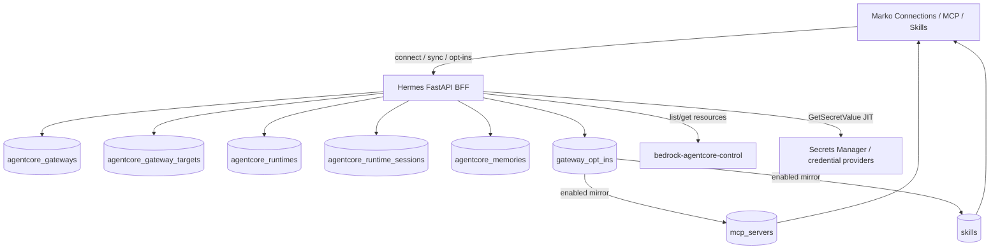

# AgentCore Gateway Integration — AWS-aligned DB + opt-in catalog

**Audience:** engineering implementing Marko ↔ Hermes ↔ Amazon Bedrock AgentCore.
**Status:** plan only — no implementation yet.
**Scope of this pass:** **Gateway-first** via AWS SDK, SQLite tables that mirror
AgentCore Runtime / Gateway / Memory control-plane fields, sync into a unified
Marko opt-in catalog, and scrollable panel shells.

Primary references:
- [AgentCore overview](https://docs.aws.amazon.com/bedrock-agentcore/latest/devguide/what-is-bedrock-agentcore.html)
- [AgentCore Gateway](https://docs.aws.amazon.com/bedrock-agentcore/latest/devguide/gateway.html)
- [Runtime sessions](https://docs.aws.amazon.com/bedrock-agentcore/latest/devguide/runtime-sessions.html)
- boto3 `bedrock-agentcore-control` (GetGateway, ListGatewayTargets, Create/GetAgentRuntime, ListMemories)
- boto3 `secretsmanager` (`GetSecretValue`) for just-in-time secret material — never persisted locally

Related plans: [DESKTOP_APP.md](./DESKTOP_APP.md) (thin Electron shell — out of scope here).

---

## 0. Locked decisions

- **AWS SDK:** boto3 `bedrock-agentcore-control` for Gateway / Targets / Runtimes / Memories; MCP tool listing against `gatewayUrl`.
- **Connect with `gatewayUrl` first.** Operators often already have the Gateway invoke URL. Marko Connections **primary field is `gatewayUrl`** (plus `region`). Optional `gatewayId` if known. Hermes persists the URL immediately, then enriches metadata via control-plane (`get_gateway` / list+match by URL). MCP `tools/list` and opt-in rebuild use the stored `gatewayUrl` even before full metadata lands.
- **DB matches AWS:** mirror tables use the **same field names** as GetGateway / ListGatewayTargets / CreateAgentRuntime / ListMemories / Runtime session docs (snake_case SQL columns = AWS JSON keys). Non-secret AWS payloads also stored in `raw_json` for forward-compat (**after redaction** — see secrets rule).
- **No secrets stored locally; fetch from AWS at runtime.** Never persist AWS access keys, secret keys, session tokens, JWT/client secrets, API keys, OAuth refresh/access tokens, MCP auth headers, or credential-provider secret *material* in SQLite, `config.yaml`, `raw_json`, opt-in metadata, Marko localStorage, or the browser. Mirror tables may keep **identifiers only** (e.g. Secrets Manager `secretArn`, credential-provider type/name, `authorizerType`). When Hermes needs a secret (Gateway MCP auth, target credential providers, etc.), resolve it **just-in-time** via AWS SDK — boto3 `secretsmanager.get_secret_value` and/or AgentCore Gateway credential-provider APIs — using the process IAM chain (IRSA / instance profile / SSO). Hold material in **process memory for the request only**; never write fetched values to disk or return them on Marko REST. Sync still **redacts** any secret material that appears in control-plane payloads before upsert.
- **Marko stays the UI; Hermes is the BFF.** No AWS credentials or secret values of any kind in the browser.
- **`gateway_opt_ins`** is the single Marko opt-in overlay (MCP / tools / skills / plugins). Sync upserts AWS mirror tables first, then flattens into opt-ins; enabling mirrors into existing `mcp_registry` / `skills_registry` (mirror rows store URL/name + optional `secretArn` pointer only; live auth is fetched via AWS SDK when testing/calling MCP).
- **All panels scroll** via shared `PanelChrome` + route `overflow-hidden`.



---

## 1. Data model — AWS-shaped mirror tables + opt-in overlay

All in `state.db` via `hermes/hermes_cli/registry_schema.py`. Column names follow
AWS API JSON keys. Timestamps stored as ISO-8601 TEXT.

**Rules:**
- Sync **never invents** AWS field names — upsert from SDK response dicts; unknown future **non-secret** keys remain in `raw_json`.
- Sync **never stores secret material** — run `_redact_secrets(obj)` before column mapping and before writing `raw_json`. Strip values for keys matching (case-insensitive): `secret` (except keep `*Arn` / `*ARN` **identifier** strings), `password`, `token`, `apiKey`/`api_key`, `accessKey`, `secretKey`, `clientSecret`, `authorization` header values, credential value blobs. Prefer omitting whole secret blocks over placeholders.
- **Resolve secrets via AWS SDK at use-time:** `secretsmanager.get_secret_value(SecretId=arn)` and AgentCore Gateway credential-provider resolution. Optional short-lived in-memory cache (TTL seconds, never disk). IAM must allow `secretsmanager:GetSecretValue` on the referenced ARNs.

### 1a. `agentcore_gateways` — mirrors `GetGateway`

| Column | AWS field | Notes |
|---|---|---|
| `gateway_id` PK | `gatewayId` | |
| `gateway_arn` | `gatewayArn` | |
| `gateway_url` | `gatewayUrl` | MCP invoke endpoint |
| `name` | `name` | |
| `description` | `description` | |
| `status` | `status` | CREATING\|UPDATING\|…\|READY\|FAILED |
| `status_reasons_json` | `statusReasons` | JSON array |
| `role_arn` | `roleArn` | |
| `protocol_type` | `protocolType` | MCP |
| `protocol_configuration_json` | `protocolConfiguration` | |
| `authorizer_type` | `authorizerType` | CUSTOM_JWT\|AWS_IAM\|NONE\|… |
| `authorizer_configuration_json` | `authorizerConfiguration` | redacted — no client secrets / JWKS private material |
| `kms_key_arn` | `kmsKeyArn` | ARN only |
| `workload_identity_arn` | `workloadIdentityDetails.workloadIdentityArn` | |
| `region` | (client) | |
| `created_at` / `updated_at` | `createdAt` / `updatedAt` | |
| `last_synced_at` | local | |
| `raw_json` | GetGateway body **after redaction** | forward-compat; never secret material |

### 1b. `agentcore_gateway_targets` — mirrors `ListGatewayTargets` / GetGatewayTarget

| Column | AWS field |
|---|---|
| `target_id` PK | `targetId` |
| `gateway_id` FK | `gatewayIdentifier` / parent |
| `name` | `name` |
| `description` | `description` |
| `status` | `status` (incl. SYNCHRONIZING, READY, …) |
| `target_type` | `targetType` (MCP_SERVER\|LAMBDA\|OPEN_API_SCHEMA\|…) |
| `listing_mode` | `listingMode` (DEFAULT\|DYNAMIC) |
| `resource_priority` | `resourcePriority` |
| `last_synchronized_at` | `lastSynchronizedAt` |
| `target_configuration_json` | `targetConfiguration` |
| `credential_provider_configurations_json` | `credentialProviderConfigurations` | types + `secretArn` pointers only |
| `authorization_data_json` | `authorizationData` | omit material; keep ARNs/types if present |
| `created_at` / `updated_at` | AWS timestamps |
| `raw_json` | target object **after redaction** |

### 1c. `agentcore_runtimes` — mirrors `CreateAgentRuntime` / GetAgentRuntime

| Column | AWS field |
|---|---|
| `agent_runtime_id` PK | derived from ARN or API id |
| `agent_runtime_arn` | `agentRuntimeArn` |
| `agent_runtime_name` | `agentRuntimeName` |
| `description` | `description` |
| `status` | `status` (CREATING\|READY\|…) |
| `role_arn` | `roleArn` |
| `agent_runtime_artifact_json` | `agentRuntimeArtifact` |
| `network_configuration_json` | `networkConfiguration` (`networkMode` PUBLIC\|VPC, subnets, SGs) |
| `protocol_configuration_json` | `protocolConfiguration` (`serverProtocol`: MCP\|HTTP\|A2A\|**AGUI**) |
| `lifecycle_configuration_json` | `lifecycleConfiguration` (`idleRuntimeSessionTimeout`, `maxLifetime`) |
| `filesystem_configurations_json` | `filesystemConfigurations` |
| `environment_variables_json` | `environmentVariables` |
| `authorizer_configuration_json` | `authorizerConfiguration` | redacted |
| `region` | (client) | |
| `created_at` / `updated_at` / `last_synced_at` | |
| `raw_json` | runtime object **after redaction** |

### 1d. `agentcore_runtime_sessions` — mirrors Runtime session model

| Column | AWS / docs field |
|---|---|
| `runtime_session_id` PK | `runtimeSessionId` (≥33 chars) |
| `agent_runtime_arn` FK | Runtime ARN |
| `status` | Active \| Stopped (compute lifecycle) |
| `marko_thread_id` | local Marko `threadId` correlation |
| `idle_runtime_session_timeout` | from lifecycle config snapshot |
| `max_lifetime` | from lifecycle config snapshot |
| `last_invoked_at` | local |
| `created_at` / `updated_at` | |
| `raw_json` | optional invoke metadata |

### 1e. `agentcore_memories` — mirrors `ListMemories` / GetMemory

| Column | AWS field |
|---|---|
| `id` PK | `id` |
| `arn` | `arn` |
| `status` | CREATING\|ACTIVE\|FAILED\|… |
| `managed_by_resource_arn` | `managedByResourceArn` |
| `created_at` / `updated_at` / `last_synced_at` | |
| `raw_json` | |

### 1f. `gateway_opt_ins` — Marko unified opt-in (not an AWS resource)

Flattened catalog for the Connections table; FKs point at AWS mirror rows when applicable:

```sql
gateway_opt_ins (
  id TEXT PRIMARY KEY,
  resource_type TEXT NOT NULL,       -- mcp_server | mcp_tool | skill | plugin | tool
  gateway_id TEXT,                   -- FK agentcore_gateways
  gateway_target_id TEXT,            -- FK agentcore_gateway_targets (MCP)
  agent_runtime_arn TEXT,            -- optional link if tool hosted on Runtime
  resource_key TEXT NOT NULL,        -- target name / tool name / skill id / plugin name
  display_name TEXT NOT NULL,
  description TEXT,
  aws_status TEXT,                   -- copied from target/runtime status for UI
  enabled INTEGER NOT NULL DEFAULT 0,
  local_id TEXT,                     -- mcp_servers.id / skills.id after mirror
  metadata_json TEXT,
  last_synced_at TEXT,
  created_at TEXT,
  updated_at TEXT,
  UNIQUE (gateway_id, resource_type, resource_key)
)
```

Profile config (pointers only; rows live in SQLite). **No secrets in YAML:**

```yaml
agentcore:
  region: us-east-1
  gateway_url: "https://...."       # primary connect input (Gateway invoke / MCP URL)
  gateway_id: "..."                 # optional; filled after control-plane enrich
  agent_runtime_arn: "..."          # optional default runtime
  memory_id: "..."                  # optional default memory
  # NEVER: aws_access_key_id, aws_secret_access_key, session_token, client_secret, api_key
```

Credentials / secrets resolution (process only; never written to disk by this feature):

1. Control-plane + data-plane IAM: IRSA → instance profile → Hermes/AWS SSO env chain (boto3 default).
2. Application secrets referenced by Gateway targets: `boto3.client("secretsmanager").get_secret_value(...)` using stored `secretArn` pointers.
3. Never put secret values in REST JSON to Marko; never log secret bodies.

---

## 2. AWS SDK module

New: `hermes/hermes_cli/agentcore_gateway.py` (+ thin runtime/memory list helpers).

| Function | SDK | Writes |
|---|---|---|
| `connect_gateway(gateway_url, *, region, gateway_id=None)` | Persist URL; if `gateway_id` → `get_gateway`; else `list_gateways` and match `gatewayUrl`; if no match, upsert URL-only row (`status=PENDING_ENRICH`) | `agentcore_gateways` (redacted) + config `gateway_url` |
| `sync_gateway_targets(gateway_id)` | `list_gateway_targets` (+ get/synchronize as needed); requires resolved `gateway_id` when possible — if URL-only, MCP `tools/list` against `gateway_url` still rebuilds tool opt-ins | `agentcore_gateway_targets` (redacted; keep `secretArn` pointers) |
| `sync_runtimes()` | `list_agent_runtimes` / get | `agentcore_runtimes` |
| `sync_memories()` | `list_memories` | `agentcore_memories` |
| `rebuild_opt_ins(gateway_id)` | flatten targets + MCP `tools/list` **via stored `gatewayUrl`** + local skills/plugins/tools | `gateway_opt_ins` (preserve `enabled`) |
| `apply_opt_in(id, enabled)` | — | mirror into mcp/skills/plugins/toolsets (no secret material) |
| `resolve_secret(secret_arn)` | `secretsmanager.get_secret_value` | **nothing** — return value in-memory for caller only |

Connect algorithm (`PUT /api/gateway/connection` body: `{ region, gatewayUrl, gatewayId? }`):

1. Validate `gatewayUrl` (https). Save to config + upsert `agentcore_gateways.gateway_url`.
2. If `gatewayId` provided → `get_gateway` → merge AWS fields (must match URL when both present).
3. Else → `list_gateways` (paginated) → find row where `gatewayUrl` equals input → set `gateway_id` / ARN / status.
4. If control-plane unreachable or no match → keep URL row; UI shows connected-by-URL; sync still lists MCP tools from the URL.
5. Never store secrets from the URL or headers.

Sync algorithm (`POST /api/gateway/sync`):

1. `get_gateway` → upsert `agentcore_gateways` (status must be READY to continue tools).
2. `list_gateway_targets` → upsert `agentcore_gateway_targets`.
3. Optionally `list_agent_runtimes` + `list_memories` → upsert runtime/memory tables (same sync button keeps DB AWS-complete).
4. Rebuild opt-ins from targets (`mcp_server`) + per-target tools (`mcp_tool`) + local skills/plugins/toolsets.
5. **Never** change `enabled` on sync.
6. Re-apply mirrors for all `enabled=1` rows.

---

## 3. REST API (Marko)

| Method | Path | Behavior |
|---|---|---|
| GET | `/api/gateway/status` | From `agentcore_gateways` row + last sync + counts |
| PUT | `/api/gateway/connection` | Body `{ region, gatewayUrl, gatewayId? }` → URL-first connect + optional control-plane enrich |
| POST | `/api/gateway/sync` | Full sync algorithm |
| GET | `/api/gateway/opt-ins` | List opt-ins (`?type=`, `?enabled=`) |
| PUT | `/api/gateway/opt-ins/{id}` | Toggle + mirror |
| PUT | `/api/gateway/opt-ins/bulk` | Bulk toggle |
| GET | `/api/gateway/runtimes` | List `agentcore_runtimes` (read-only in this pass) |
| GET | `/api/gateway/memories` | List `agentcore_memories` |

DTOs in `packages/shared/src/api-types.ts` use **AWS field names in camelCase**
(`gatewayId`, `gatewayArn`, `agentRuntimeArn`, `runtimeSessionId`, …) so UI/API
match SDK docs. Capability flag: `features.agentcoreGateway` (or equivalent)
when routes are present.

---

## 4. Marko UI — opt-in table + panel scroll

### 4a. Connections Gateway section

- Connect (**region + gateway URL**, optional gateway id) → status chip from `agentcore_gateways.status` (or “URL connected” if pending enrich)
- Sync → refreshes AWS mirror tables + opt-in catalog
- **One scrollable opt-in table:** Type \| Name \| Target/Runtime \| AWS status \| Opt-in
- Filters: All / MCP / Tools / Skills / Plugins
- Enable MCP → refresh `['mcp-servers']`; enable skill → `['skills']`

### 4b. Scroll all panels

Route `ui/src/routes/panel.$name.tsx`: all panels use `overflow-hidden` (workspace
already does). Shared `PanelChrome` with `min-h-0 flex-1 overflow-y-auto` for list
bodies. Apply to Sessions, Skills, Memory, Connections, McpSubPanel list, Cron,
Kanban, Profiles, Settings.

---

## 5. Implementation sequence

1. `registry_schema.py` mirror tables + `gateway_opt_ins` + tests.
2. boto3 sync upserts (fake client fixtures asserting column↔AWS key mapping) + **redaction unit tests** (fixtures with fake secrets must not appear in DB/`raw_json`).
3. REST + shared types (responses also redacted).
4. Connections UI opt-in table.
5. Panel scroll shell.
6. Smoke: connect → sync → AWS rows present → enable MCP → MCP panel; scroll works; DB dump contains no secret substrings from fixtures.

---

## 6. Out of scope for this pass

- Invoking Runtime chat (`InvokeAgentRuntime`) end-to-end (tables are ready; chat adapter is next phase).
- Creating Gateways/Runtimes in AWS from Marko (connect + sync existing resources only).
- Desktop Electron shell ([DESKTOP_APP.md](./DESKTOP_APP.md)).
- Full enterprise IdP / VPC / Policy / Observability rollout (next phases after Gateway sync lands).

---

## 7. Acceptance

- [ ] Connect with **gateway URL** (+ region) upserts `agentcore_gateways.gateway_url`; optional id enrich fills AWS field names.
- [ ] Sync fills targets / runtimes / memories mirror tables when control-plane works; MCP tools still list from `gatewayUrl` if URL-only.
- [ ] `raw_json` retains redacted SDK bodies.
- [ ] Opt-ins appear in one Connections table; default `enabled=0`; sticky across re-sync.
- [ ] Enabling an MCP opt-in mirrors into `mcp_servers` and shows in MCP panel.
- [ ] Enabling a skill opt-in mirrors into skills registry and shows in Skills panel.
- [ ] All IconRail panels scroll list bodies without clipping.
- [ ] No AWS credentials or secret values in the browser; Hermes uses runtime IAM + JIT `GetSecretValue`.
- [ ] No secret material in SQLite / `config.yaml` / API responses; only `secretArn` (and similar) identifiers may be stored.
- [ ] MCP test/call path fetches secrets via AWS SDK at use-time; values never logged or persisted.

---

## 8. Doc index

| Doc | Role |
|---|---|
| This file | AgentCore Gateway + AWS-aligned schema plan |
| [PANELS.md](./PANELS.md) | Connections Gateway section + panel scroll |
| [API_MAPPING.md](./API_MAPPING.md) | Planned `/api/gateway/*` routes |
| [ONE_HOP_ARCHITECTURE.md](./ONE_HOP_ARCHITECTURE.md) | Still one hop browser→Hermes; Hermes calls AWS |
| [DESKTOP_APP.md](./DESKTOP_APP.md) | Desktop shell; AgentCore remains server-side |

*Marko remains the only UI. Hermes is the BFF. AgentCore Gateway is the first production integration surface; Runtime invoke is a follow-on phase.*
