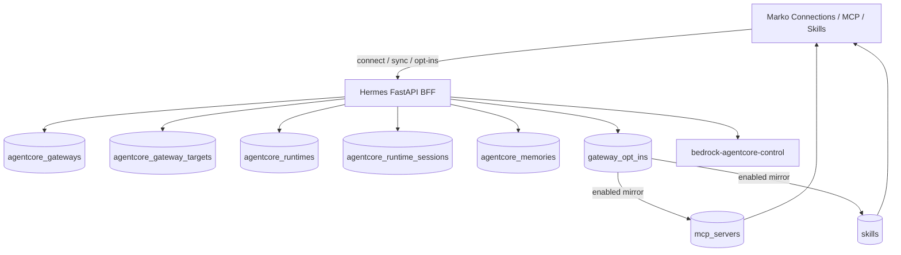

# AgentCore Gateway Integration — AWS-aligned DB + opt-in catalog

**Audience:** engineering implementing Marko ↔ Hermes ↔ Amazon Bedrock AgentCore.
**Status:** plan only — no implementation yet.
**Scope of this pass:** **Gateway-first** via AWS SDK, SQLite tables that mirror
AgentCore Runtime / Gateway / Memory control-plane fields, sync into a unified
Marko opt-in catalog, and scrollable panel shells.

Primary references:
- [AgentCore overview](https://docs.aws.amazon.com/bedrock-agentcore/latest/devguide/what-is-bedrock-agentcore.html)
- [AgentCore Gateway](https://docs.aws.amazon.com/bedrock-agentcore/latest/devguide/gateway.html)
- [Runtime sessions](https://docs.aws.amazon.com/bedrock-agentcore/latest/devguide/runtime-sessions.html)
- boto3 `bedrock-agentcore-control` (GetGateway, ListGatewayTargets, Create/GetAgentRuntime, ListMemories)

Related plans: [DESKTOP_APP.md](./DESKTOP_APP.md) (thin Electron shell — out of scope here).

---

## 0. Locked decisions

- **AWS SDK:** boto3 `bedrock-agentcore-control` for Gateway / Targets / Runtimes / Memories; MCP tool listing against `gatewayUrl`.
- **DB matches AWS:** mirror tables use the **same field names** as GetGateway / ListGatewayTargets / CreateAgentRuntime / ListMemories / Runtime session docs (snake_case SQL columns = AWS JSON keys). Full AWS payloads also stored in `raw_json` for forward-compat.
- **Marko stays the UI; Hermes is the BFF.** No AWS keys in the browser.
- **`gateway_opt_ins`** is the single Marko opt-in overlay (MCP / tools / skills / plugins). Sync upserts AWS mirror tables first, then flattens into opt-ins; enabling mirrors into existing `mcp_registry` / `skills_registry`.
- **All panels scroll** via shared `PanelChrome` + route `overflow-hidden`.



---

## 1. Data model — AWS-shaped mirror tables + opt-in overlay

All in `state.db` via `hermes/hermes_cli/registry_schema.py`. Column names follow
AWS API JSON keys. Timestamps stored as ISO-8601 TEXT.

**Rule:** sync **never invents** AWS field names — upsert from SDK response
dicts; unknown future keys remain in `raw_json`.

### 1a. `agentcore_gateways` — mirrors `GetGateway`

| Column | AWS field | Notes |
|---|---|---|
| `gateway_id` PK | `gatewayId` | |
| `gateway_arn` | `gatewayArn` | |
| `gateway_url` | `gatewayUrl` | MCP invoke endpoint |
| `name` | `name` | |
| `description` | `description` | |
| `status` | `status` | CREATING\|UPDATING\|…\|READY\|FAILED |
| `status_reasons_json` | `statusReasons` | JSON array |
| `role_arn` | `roleArn` | |
| `protocol_type` | `protocolType` | MCP |
| `protocol_configuration_json` | `protocolConfiguration` | |
| `authorizer_type` | `authorizerType` | CUSTOM_JWT\|AWS_IAM\|NONE\|… |
| `authorizer_configuration_json` | `authorizerConfiguration` | |
| `kms_key_arn` | `kmsKeyArn` | |
| `workload_identity_arn` | `workloadIdentityDetails.workloadIdentityArn` | |
| `region` | (client) | |
| `created_at` / `updated_at` | `createdAt` / `updatedAt` | |
| `last_synced_at` | local | |
| `raw_json` | full GetGateway body | forward-compat |

### 1b. `agentcore_gateway_targets` — mirrors `ListGatewayTargets` / GetGatewayTarget

| Column | AWS field |
|---|---|
| `target_id` PK | `targetId` |
| `gateway_id` FK | `gatewayIdentifier` / parent |
| `name` | `name` |
| `description` | `description` |
| `status` | `status` (incl. SYNCHRONIZING, READY, …) |
| `target_type` | `targetType` (MCP_SERVER\|LAMBDA\|OPEN_API_SCHEMA\|…) |
| `listing_mode` | `listingMode` (DEFAULT\|DYNAMIC) |
| `resource_priority` | `resourcePriority` |
| `last_synchronized_at` | `lastSynchronizedAt` |
| `target_configuration_json` | `targetConfiguration` |
| `credential_provider_configurations_json` | `credentialProviderConfigurations` |
| `authorization_data_json` | `authorizationData` |
| `created_at` / `updated_at` | AWS timestamps |
| `raw_json` | full target object |

### 1c. `agentcore_runtimes` — mirrors `CreateAgentRuntime` / GetAgentRuntime

| Column | AWS field |
|---|---|
| `agent_runtime_id` PK | derived from ARN or API id |
| `agent_runtime_arn` | `agentRuntimeArn` |
| `agent_runtime_name` | `agentRuntimeName` |
| `description` | `description` |
| `status` | `status` (CREATING\|READY\|…) |
| `role_arn` | `roleArn` |
| `agent_runtime_artifact_json` | `agentRuntimeArtifact` |
| `network_configuration_json` | `networkConfiguration` (`networkMode` PUBLIC\|VPC, subnets, SGs) |
| `protocol_configuration_json` | `protocolConfiguration` (`serverProtocol`: MCP\|HTTP\|A2A\|**AGUI**) |
| `lifecycle_configuration_json` | `lifecycleConfiguration` (`idleRuntimeSessionTimeout`, `maxLifetime`) |
| `filesystem_configurations_json` | `filesystemConfigurations` |
| `environment_variables_json` | `environmentVariables` |
| `authorizer_configuration_json` | `authorizerConfiguration` |
| `region` | (client) | |
| `created_at` / `updated_at` / `last_synced_at` | |
| `raw_json` | full runtime object |

### 1d. `agentcore_runtime_sessions` — mirrors Runtime session model

| Column | AWS / docs field |
|---|---|
| `runtime_session_id` PK | `runtimeSessionId` (≥33 chars) |
| `agent_runtime_arn` FK | Runtime ARN |
| `status` | Active \| Stopped (compute lifecycle) |
| `marko_thread_id` | local Marko `threadId` correlation |
| `idle_runtime_session_timeout` | from lifecycle config snapshot |
| `max_lifetime` | from lifecycle config snapshot |
| `last_invoked_at` | local |
| `created_at` / `updated_at` | |
| `raw_json` | optional invoke metadata |

### 1e. `agentcore_memories` — mirrors `ListMemories` / GetMemory

| Column | AWS field |
|---|---|
| `id` PK | `id` |
| `arn` | `arn` |
| `status` | CREATING\|ACTIVE\|FAILED\|… |
| `managed_by_resource_arn` | `managedByResourceArn` |
| `created_at` / `updated_at` / `last_synced_at` | |
| `raw_json` | |

### 1f. `gateway_opt_ins` — Marko unified opt-in (not an AWS resource)

Flattened catalog for the Connections table; FKs point at AWS mirror rows when applicable:

```sql
gateway_opt_ins (
  id TEXT PRIMARY KEY,
  resource_type TEXT NOT NULL,       -- mcp_server | mcp_tool | skill | plugin | tool
  gateway_id TEXT,                   -- FK agentcore_gateways
  gateway_target_id TEXT,            -- FK agentcore_gateway_targets (MCP)
  agent_runtime_arn TEXT,            -- optional link if tool hosted on Runtime
  resource_key TEXT NOT NULL,        -- target name / tool name / skill id / plugin name
  display_name TEXT NOT NULL,
  description TEXT,
  aws_status TEXT,                   -- copied from target/runtime status for UI
  enabled INTEGER NOT NULL DEFAULT 0,
  local_id TEXT,                     -- mcp_servers.id / skills.id after mirror
  metadata_json TEXT,
  last_synced_at TEXT,
  created_at TEXT,
  updated_at TEXT,
  UNIQUE (gateway_id, resource_type, resource_key)
)
```

Profile config (pointers only; rows live in SQLite):

```yaml
agentcore:
  region: us-east-1
  gateway_id: "..."                 # PK into agentcore_gateways
  agent_runtime_arn: "..."          # optional default runtime
  memory_id: "..."                  # optional default memory
```

---

## 2. AWS SDK module

New: `hermes/hermes_cli/agentcore_gateway.py` (+ thin runtime/memory list helpers).

| Function | SDK | Writes |
|---|---|---|
| `connect_gateway(gateway_id)` | `get_gateway` | `agentcore_gateways` |
| `sync_gateway_targets(gateway_id)` | `list_gateway_targets` (+ get/synchronize as needed) | `agentcore_gateway_targets` |
| `sync_runtimes()` | `list_agent_runtimes` / get | `agentcore_runtimes` |
| `sync_memories()` | `list_memories` | `agentcore_memories` |
| `rebuild_opt_ins(gateway_id)` | flatten targets + MCP `tools/list` + local skills/plugins/tools | `gateway_opt_ins` (preserve `enabled`) |
| `apply_opt_in(id, enabled)` | — | mirror into mcp/skills/plugins/toolsets |

Sync algorithm (`POST /api/gateway/sync`):

1. `get_gateway` → upsert `agentcore_gateways` (status must be READY to continue tools).
2. `list_gateway_targets` → upsert `agentcore_gateway_targets`.
3. Optionally `list_agent_runtimes` + `list_memories` → upsert runtime/memory tables (same sync button keeps DB AWS-complete).
4. Rebuild opt-ins from targets (`mcp_server`) + per-target tools (`mcp_tool`) + local skills/plugins/toolsets.
5. **Never** change `enabled` on sync.
6. Re-apply mirrors for all `enabled=1` rows.

---

## 3. REST API (Marko)

| Method | Path | Behavior |
|---|---|---|
| GET | `/api/gateway/status` | From `agentcore_gateways` row + last sync + counts |
| PUT | `/api/gateway/connection` | `get_gateway` → upsert gateway row + config.yaml |
| POST | `/api/gateway/sync` | Full sync algorithm |
| GET | `/api/gateway/opt-ins` | List opt-ins (`?type=`, `?enabled=`) |
| PUT | `/api/gateway/opt-ins/{id}` | Toggle + mirror |
| PUT | `/api/gateway/opt-ins/bulk` | Bulk toggle |
| GET | `/api/gateway/runtimes` | List `agentcore_runtimes` (read-only in this pass) |
| GET | `/api/gateway/memories` | List `agentcore_memories` |

DTOs in `packages/shared/src/api-types.ts` use **AWS field names in camelCase**
(`gatewayId`, `gatewayArn`, `agentRuntimeArn`, `runtimeSessionId`, …) so UI/API
match SDK docs. Capability flag: `features.agentcoreGateway` (or equivalent)
when routes are present.

---

## 4. Marko UI — opt-in table + panel scroll

### 4a. Connections Gateway section

- Connect (region + gateway id) → status chip from `agentcore_gateways.status`
- Sync → refreshes AWS mirror tables + opt-in catalog
- **One scrollable opt-in table:** Type \| Name \| Target/Runtime \| AWS status \| Opt-in
- Filters: All / MCP / Tools / Skills / Plugins
- Enable MCP → refresh `['mcp-servers']`; enable skill → `['skills']`

### 4b. Scroll all panels

Route `ui/src/routes/panel.$name.tsx`: all panels use `overflow-hidden` (workspace
already does). Shared `PanelChrome` with `min-h-0 flex-1 overflow-y-auto` for list
bodies. Apply to Sessions, Skills, Memory, Connections, McpSubPanel list, Cron,
Kanban, Profiles, Settings.

---

## 5. Implementation sequence

1. `registry_schema.py` mirror tables + `gateway_opt_ins` + tests.
2. boto3 sync upserts (fake client fixtures asserting column↔AWS key mapping).
3. REST + shared types.
4. Connections UI opt-in table.
5. Panel scroll shell.
6. Smoke: connect → sync → AWS rows present → enable MCP → MCP panel; scroll works.

---

## 6. Out of scope for this pass

- Invoking Runtime chat (`InvokeAgentRuntime`) end-to-end (tables are ready; chat adapter is next phase).
- Creating Gateways/Runtimes in AWS from Marko (connect + sync existing resources only).
- Desktop Electron shell ([DESKTOP_APP.md](./DESKTOP_APP.md)).
- Full enterprise IdP / VPC / Policy / Observability rollout (next phases after Gateway sync lands).

---

## 7. Acceptance

- [ ] Connect with region + gateway id upserts `agentcore_gateways` with AWS field names.
- [ ] Sync fills targets / runtimes / memories mirror tables; `raw_json` retains full SDK bodies.
- [ ] Opt-ins appear in one Connections table; default `enabled=0`; sticky across re-sync.
- [ ] Enabling an MCP opt-in mirrors into `mcp_servers` and shows in MCP panel.
- [ ] Enabling a skill opt-in mirrors into skills registry and shows in Skills panel.
- [ ] All IconRail panels scroll list bodies without clipping.
- [ ] No AWS credentials in the browser; only Hermes server-side SDK.

---

## 8. Doc index

| Doc | Role |
|---|---|
| This file | AgentCore Gateway + AWS-aligned schema plan |
| [PANELS.md](./PANELS.md) | Connections Gateway section + panel scroll |
| [API_MAPPING.md](./API_MAPPING.md) | Planned `/api/gateway/*` routes |
| [ONE_HOP_ARCHITECTURE.md](./ONE_HOP_ARCHITECTURE.md) | Still one hop browser→Hermes; Hermes calls AWS |
| [DESKTOP_APP.md](./DESKTOP_APP.md) | Desktop shell; AgentCore remains server-side |

*Marko remains the only UI. Hermes is the BFF. AgentCore Gateway is the first production integration surface; Runtime invoke is a follow-on phase.*
